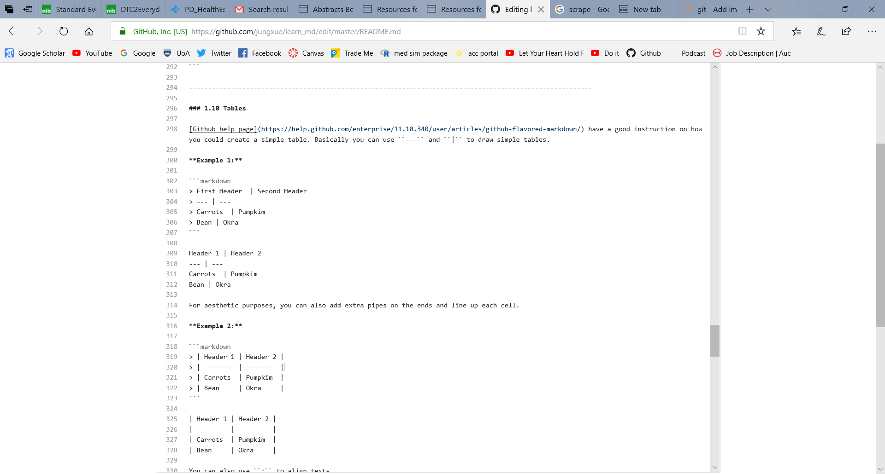
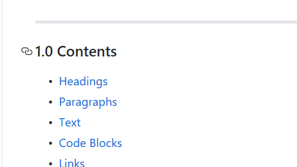
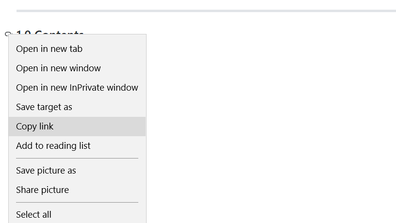

# Markdown files

This is a collections of notes on useful codes and tips that I will use to build my github, I will try to add to this everytime I learnt something new, it will start as a list and when I start to learn lots of things I will try to create a table of lists and add in codes to make this more presentable. 

I am well aware that these codes are not the standardise way or the best way to write a markdown file, it is my personal preference and they will surely change over time, so if anyone found a better way you are surely wellcome to enlight me. 

I am writing this file as a learning process, I tend to read about codes from various sources, and manually type a study note style file myself as I found this helps me remember things better, it is really time consuming though. I will try my best to source, sourcing is a way to show gratitude to authors and makes things easier when you need to revisit the source for whatever reason. 

-----------------------------------------------------------------------------------------------
### 1.0 Contents

- [Headings](https://github.com/jungxue/learn_github/blob/master/README.md#11-headings)
- [Paragraphs](https://github.com/jungxue/learn_github/blob/master/README.md#12-paragraphs)
- [Text](https://github.com/jungxue/learn_md#13-text)
- [Code Blocks](https://github.com/jungxue/learn_md/blob/master/README.md#14-code-blocks)
- [Links](https://github.com/jungxue/learn_md/blob/master/README.md#15---links)
- [Quotes](https://github.com/jungxue/learn_md/blob/master/README.md#16-quotes)
- [Lists](https://github.com/jungxue/learn_md/blob/master/README.md#17-lists)
- [Keyboard glyphs](https://github.com/jungxue/learn_md/blob/master/README.md#18-keyboard-glyphs)
- [Horizontal Rule](https://github.com/jungxue/learn_md/blob/master/README.md#19-horizontal-rule)
- [Tables](https://github.com/jungxue/learn_md/blob/master/README.md#110-tables)
- [Emoji](https://github.com/jungxue/learn_md/blob/master/README.md#111-emoji-smiley)
- [Pictures and GIFS](https://github.com/jungxue/learn_md/blob/master/README.md#112-insert-pictures)
- [Backslash escapes](https://github.com/jungxue/learn_md/blob/master/README.md#113-backslash-escapes+)
- [Section link](https://github.com/jungxue/learn_md#114-section-links)
- [Relative Link](https://github.com/jungxue/learn_md/blob/master/README.md#115-relative-links)
- [References](https://github.com/jungxue/learn_md/blob/master/README.md#2-references)

----------------------------------------------------------------------------------------------

### 1.1 Headings 
I found #heading ##heading and ###heading most useful, I tried to add color and change font but I do not think I can, and later realised that I do not actually need to do too much fancy stuff, just keep things simple and concise and future me reading this will surely thank my decision.

You can also use === and --- but I don not recommend it because it makes codes messy, but I can see why some people prefer to use it, I often use these codes in Microsoft Word.

```markdown
> # heading 1
> ## heading 2
> ### heading 3
> #### heading 4
> ##### heading 5
> ###### heading 6
> heading 1
> ===
> heading 2
> ---
```
# heading 1
## heading 2
### heading 3
#### heading 4
##### heading 5
###### heading 6
heading 1
===
heading 2
---

---------------------------------------------------------------------------------------------

### 1.2 Paragraphs
Paragraphs are separated by empty lines. To create a new paragraph, press <kbd>Enter</kbd> <kbd>Enter</kbd>.

```markdown
> Paragraph 1
>
> Paragraph 2
```
Paragraph 1

Paragraph 2

MD file will automatically attach your paragraphs if there is no empty line separating your paragraphs. 

```markdown
> Paragraph 1
> Paragraph 2
```
Paragraph 1
Paragraph 2

--------------------------------------------------------------------------------------------------------

### 1.3 Text

Basic *italic* and **bold** text will be useful, however use of  ``*`` and ``**`` is ineffecient and limiting. You can use shortcuts <kbd>ctrl</kbd> + <kbd>I</kbd>  and <kbd>ctrl</kbd> + <kbd>B</kbd>, however I noticed it works on Unversity PC but not on my Laptop. 

| Style             | Syntax    | Keyboard shortcut             | Code               | Output            |
| :---------------: |:---------:| :----------------------------:|:------------------:| :----------------:|
| Italic            | ``* *``   | <kbd>ctrl</kbd> + <kbd>I</kbd>| ``*Italic*``       | *Italic*          |
| Bold              | ``** **`` | <kbd>xtrl</kbd> + <kbd>B</kbd>| ``**Bold**``       | **Bold**          |
| Strike through    | ``~~ ~~`` |                               | ``Strike through`` | ~~Strike through~~|

Note: To write out astrisks ``*`` without activating it as syntax, use double grave accent <kbd>``</kbd> or single grave accent <kbd>`</kbd> to include inline code blocks. I personally prefer double as it is easier to see. 

```markdown
> This is an ``inline code block``
>
> This is an `inline code block`
``` 

This is an ``inline code block``

This is an `inline code block`

--------------------------------------------------------------------------------------------------------

### 1.4 Code blocks
the general syntax for a block of code in markdown files is, you will find the grave accent  <kbd>`</kbd> (it is under the tilde <kbd>~</kbd> symbol) on the top left of your key board. 

```markdown
> ``` language
> Code block
> ```
``` 
``` language
Code block
```

Here is a list of supported languages and lexers (by [Jeanine Adkisson](https://github.com/jneen/rouge/wiki/List-of-supported-languages-and-lexers))

I personally have the needs for R, Markdown, HTML, unfortunately I dont think there are option for SAS nor LaTeX for github Markdown files. [Rstudio](https://www.rstudio.com/) allows Latex code within RMD files, and are able to convert whole file to Latex, which is very useful for study notes and thesis writing. 

Note that i **DO NOT** add > in my markdown codes, I only add it in my example code chunks because I found that it aids visalisation. 

**Example 1: Markdown**

```markdown
> ```markdown
> > # heading
> ```
```

```markdown
> # heading
``` 
**Example 2: HTML**
```markdown
> ``` html
> 
> ``` 
```

```html

``` 
**Example 3: R**
Note that in RMD files, we use {R} rather than R{}. 
```markdown
> ```r {}
> k = vector() # add notes here
> for (i in 1:n){
> k[i] = i^2+5*i
> k
> }
> ``` 
```

```r {}
k = vector() # add notes here
for (i in 1:n){
k[i] = i^2+5*i
k
}
``` 

---------------------------------------------------------------------------------------------

### 1.5   Links

Markdown files will automatically creates links when valid URLs are written. However it is often not presentable, so to reduce the length and use description text you can create an inline link by wrapping link text in brackets [ ], and then wrapping the URL in parentheses ( ). 

You can also use the keyboard shortcut <kbd>ctrl</kbd> + <kbd>k</kbd>to create a link.

```markdown
> https://github.com/JungXue
>
> [Jung Xue](https://github.com/JungXue).
```
https://github.com/JungXue

[Jung Xue](https://github.com/JungXue)

---------------------------------------------------------------------------------------------  

### 1.6 Quotes
I see alot of people used blocked quotes in their md files, so it is definitely very useful.
However for some reason <kbd>Enter</kbd> , <kbd>Enter</kbd> does not work here, so I have to use <kbd>``\``</kbd> <kbd>Enter</kbd> here to create an empty line. 
```markdown
> > ### Blockquoted header
> > This is blockquoted text.
> > This is a second paragraph within the blockquoted text.
```
> ### Blockquoted header
> This is the first paragraph.
> This is the second paragraph. 

```markdown
> > ### Blockquoted header
> >
> > This is the first paragraph.
> >
> > This is the second paragraph. 
> >
> > hello\
> >
> > world
> >
```
> ### Blockquoted header
> This is the first paragraph.
> This is the second paragraph. 
> hello\
>
> world

-----------------------------------------------------------------------------------------------

### 1.7 Lists 

```markdown
> 1. Potato
> 2. Tomato
> 3. Tato
```
1. Potato
2. Tomato
3. Tato

```markdown
> - Regression
> - ANOVA
> - MANOVA
```

- Regression
- ANOVA
- MANOVA

Note: <kbd>*</kbd> also forms a list but I avoid it because it may interrupt syntax for bold text <kbd>``*``bold``*``</kbd>.

**Task lists** can be useful as I do setup tasks for future me to complete. use ``- [ ]`` to create a tick box and ``- [x]`` to tick the tick box. 

```markdown
- [x] Finish my thesis
- [ ] Get a job
- [ ] become a Jedi
```

- [x] Finish my thesis
- [ ] Get a job
- [ ] become a Jedi

----------------------------------------------------------------------------------------------------------

### 1.8 keyboard glyphs
You can create keyboard glyphs by using ``<kbd> </kbd>``, this is extremely useful for informing which key to press. 

Some people even made a whole keyboard with kbd, people have eway too much time to spare. See [This](https://meta.stackexchange.com/questions/1939/kbd-elements-are-way-too-intrusive).

```markdown
> <kbd> ctrl</kbd> + <kbd> B </kbd>
```

<kbd> ctrl</kbd> + <kbd> B </kbd>

----------------------------------------------------------------------------------------------------------


### 1.9 Horizontal Rule

You have probabily already noticed that I use horizontal Rule to break each sections, I find this helpful and tells you approximately how long is each section before you even started reading it. Markdown requires only three repeating ``*`` ,  ``-`` or ``=`` symbols, but I personally use a very long ``-------------------------`` to break my codes visually. 

Remember to add line breaks or you will be creating a title. 

```markdown
---
***
```

---
***

**Example**

```markdown
First Section ......

----------------------------------------------------------------------------------------------------------

Second section ......
```

----------------------------------------------------------------------------------------------------------

### 1.10 Tables

[Github help page](https://help.github.com/enterprise/11.10.340/user/articles/github-flavored-markdown/) have a good instruction on how you could create a simple table. Basically you can use ``---`` and ``|`` to draw simple tables. 

**Example 1:**

```markdown
> First Header  | Second Header
> --- | ---
> Carrots  | Pumpkim 
> Bean | Okra
```

Header 1 | Header 2
--- | ---
Carrots  | Pumpkim 
Bean | Okra

For aesthetic purposes, you can also add extra pipes on the ends and line up each cell.

**Example 2:**

```markdown
> | Header 1 | Header 2 |
> | -------- | -------- |
> | Carrots  | Pumpkim  |
> | Bean     | Okra     |
```

| Header 1 | Header 2 |
| -------- | -------- |
| Carrots  | Pumpkim  |
| Bean     | Okra     |

You can also use ``:`` to align texts. 

**Example 3:**

```markdown
| Left-Aligned  | Center Aligned  | Right Aligned |
| :------------ |:---------------:| -------------:|
| Waikato       | Andrew          | $1600         |
| Auckland      | Alex            | $1782         |
| Wellington    | Kim             | $1771         |
```

| Left-Aligned  | Center Aligned  | Right Aligned |
| :------------ |:---------------:| -------------:|
| Waikato       | Andrew          | $1600         |
| Auckland      | Alex            | $1782         |
| Wellington    | Kim             | $1771         |


----------------------------------------------------------------------------------------------------------

### 1.11. Emoji :smiley: 

You can add emojis using ``: :``, emojis are useful in noting characteristics of file, express emotions and are jsut fun to use. 
  - Emoji by [type](https://www.webpagefx.com/tools/emoji-cheat-sheet/)
  - Emoji by [alphabet](https://readme.io/emojis/)
  - Japanese Emoticons ╮(╯∀╰)╭ (by [Tsutomu Narushima](https://www.jemoticons.com/en/))
  - Japanese Emoticons （。ω。 三 ゜ω゜）としろうだよ ([Name diagnosis](https://shindanmaker.com/360578?fbclid=IwAR1gN16jGqWwpBVAYPg33KeN4ZLmXzEzOBZoBEC8jjuIp8L5EdmtfZ7nlpw))
  
```markdown
> :smiley: 
>
> ╮(╯∀╰)╭ 
```
:smiley: 

╮(╯∀╰)╭ 

------------------------------------------------------------------------------------------------------------

### 1.12 Pictures and GIFS

The simpliest way is to just use ````, I personally prefer dropping the picture file in my repository and link it directly, so I can avoid losing of images when linking to websites. 
```markdown


```


You can also adjust the size of the picture using following markdown and html codes.

```markdown
{:height="36px" width="36px"}.
{:height="40px" width="20px"}.


```


------------------------------------------------------------------------------------------------------------

### 1.13 Backslash escapes
Certain characters can be escaped with a preceding backslash to preserve the literal display of a character instead of its special Markdown syntax meaning. Do not confuse this with inline code. This applies to the following characters:

| Name              | Code      | Outout |
| :---------------  |:---------:| :-----:|
| Backslash         | ``\\``    | \\     |
| Bold              | ``\` ``   | \`     |
| Strike through    | ``\*``    | \*     |
| Underscore        | ``\_``    | \_     |
| Curly braces      | ``\{\}``  | \{\}   |
| Square braces     | ``\[\]``  | \[\]   |
| Parentheses       | ``\(\)``  | \(\)   |
| Hash              | ``\#``    | \#     |
| Greater than      | ``\>``    | \>     |
| Plus sign         | ``\+``    | \+     |
| Hyphen \(minus sign\)| ``\-`` | \-     |
| Dot               | ``\.``    | \.     |
| Exclamation mark  | ``\!``    | \!     |


------------------------------------------------------------------------------------------------------------

### 1.14 Section links

When you hover the mouse over section headings a grey link symbol will appear.



Right click and select copy link to obtain address of the section, and then use this in your section link code



```markdown
> [Headings](https://github.com/jungxue/learn_github/blob/master/README.md#11-headings)
```

[Headings](https://github.com/jungxue/learn_github/blob/master/README.md#11-headings)


------------------------------------------------------------------------------------------------------------

### 1.15 Relative links

You can use relative links in your readme file to help readers navigate to other files in your repository

```markdow
> [testing](docs/testing.txt)
```

[testing](docs/testing.txt)


### 2 References

Here are a few wiki and repository that I read to learn the basic laguage of markdown files
- [help.github](https://help.github.com/articles/basic-writing-and-formatting-syntax/)
- [Bitbucket Markdown syntax guide](https://confluence.atlassian.com/bitbucketserver/markdown-syntax-guide-776639995.html)
- [Robert Lord: lord/slate](https://github.com/lord/slate/wiki/Markdown-Syntax)
- [Alexander Dupuy: dupuy/README.rst](https://gist.github.com/dupuy/1855764)
- Posts on [stackoverflow.com](https://stackoverflow.com/) are also very helpful, I often find useful posts such as [this](https://stackoverflow.com/questions/25654845/how-can-i-create-a-text-box-for-a-note-in-markdown) when I do a google search keywords of my question such as "[warning boxes md file](https://www.google.co.nz/search?q=warning+boxes+md+file&rlz=1C1GGRV_enNZ816NZ816&oq=warning+boxes+md+file&aqs=chrome..69i57.527j0j7&sourceid=chrome&ie=UTF-8)". 
- [R-Studio cheat sheet](https://www.rstudio.com/wp-content/uploads/2015/02/rmarkdown-cheatsheet.pdf)
- [David Wells: image alignment](https://gist.github.com/DavidWells/7d2e0e1bc78f4ac59a123ddf8b74932d)

------------------------------------------------------------------------------------------------------------

### 3 Disclaimer
Opinions expressed are solely my own and do not express the views or opinions of my university or employer. 
I did not intend to copy or redistribute materials or works of other people, all works should be original, you can't lern by copy pasting others work.  

Copyright 2018 /- Jung Xue All rights reserved

------------------------------------------------------------------------------------------------------------

### To do list

- [x] complete first draft
- [ ] grammar and spelling check
- [ ] addition of new tricks when you learn something new
